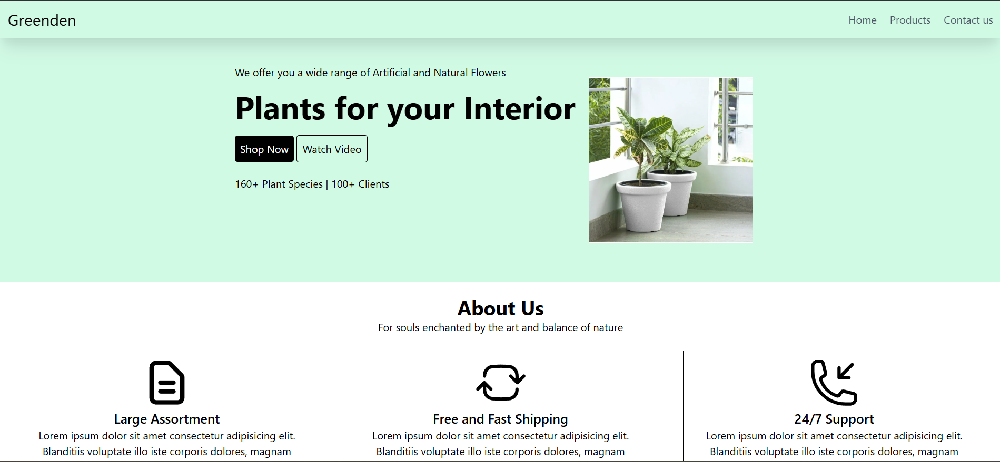
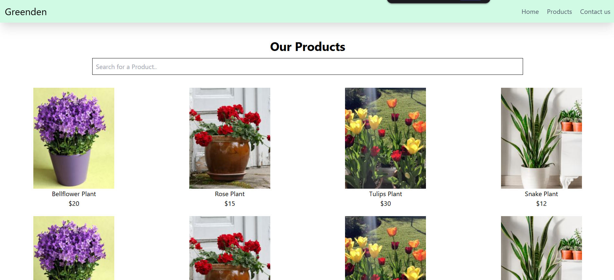
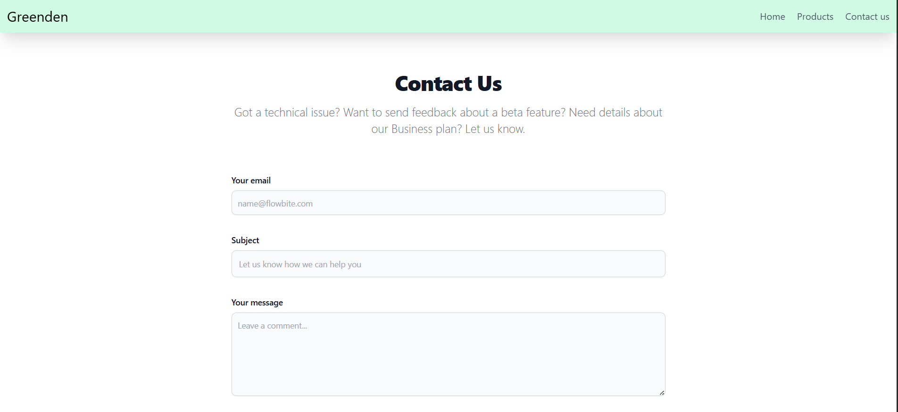

# 🌱 Greenden – Plant Store Website

Greenden is a **responsive plant store website** built using **HTML5, TailwindCSS, and JavaScript**.  
It demonstrates how an e-commerce website works with modern UI, product filtering, and interactive features.  

  

---

## 🔗 Live Demo  
👉 [Visit Greenden Live](https://srinithish-dev-lab.github.io/GreenDen-Tailwind/index.html)  

## 📂 Repository  
👉 [GitHub Repo](https://github.com/srinithish-dev-lab/GreenDen-Tailwind)  

---

## ✨ Features

### 🌐 General
- Fully **responsive design** for mobile, tablet, and desktop
- **Navigation bar & sidebar** with smooth toggle functionality
- Clean and modern UI with **TailwindCSS styling**

### 🏠 Home Page (`index.html`)
- Hero section with call-to-action buttons  
- About section explaining store highlights  
- Best Sellers section showcasing popular plants  
- Customer Reviews section styled with testimonials  
- Newsletter subscription form  

### 🛒 Products Page (`product.html`)
- Grid display of all available plants  
- **Live Search Filter** – instantly filter products as you type  
- Hover animations for better user interaction  

### 📩 Contact Page (`contact.html`)
- Contact form with fields: **Email, Subject, Message**  
- Responsive design with Tailwind styling  
- Footer with store branding  

### 🔍 Search Demo (`search.html`)
- Simple demo of live text search functionality  
- Useful for testing filtering logic  

### 🖼️ Layout Demo (`task.html`)
- Example of **CSS Grid Layout** with header, footer, sidebar, and content areas  
- Helpful for practicing responsive layout structures  

---

## 🛠️ Tech Stack

- **Frontend:** HTML5, TailwindCSS  
- **Styling:** TailwindCSS utilities + custom CSS (in `task.html`)  
- **Interactivity:** Vanilla JavaScript (DOM manipulation, event listeners)  
- **Layout:** CSS Grid & Flexbox  

---

## 📸 Screenshots

### 🏠 Home Page

### 🛒 Products Page

### 📩 Contact Page

